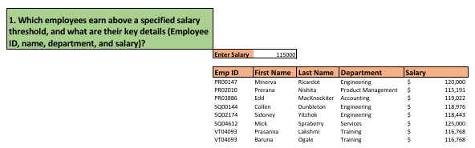
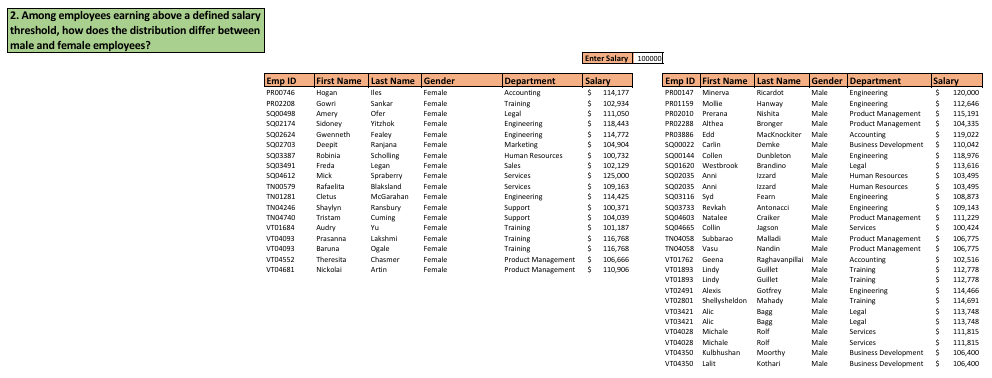
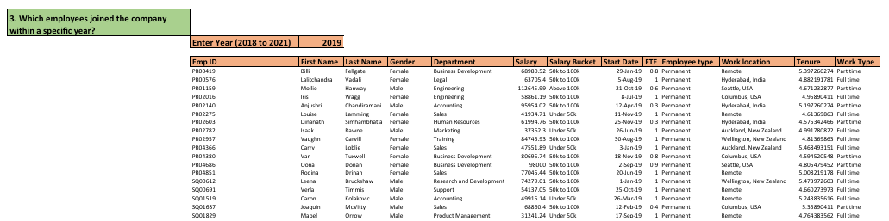
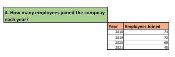
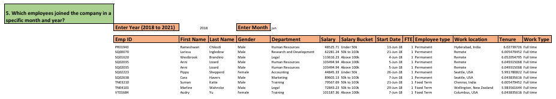
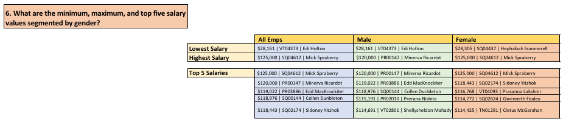
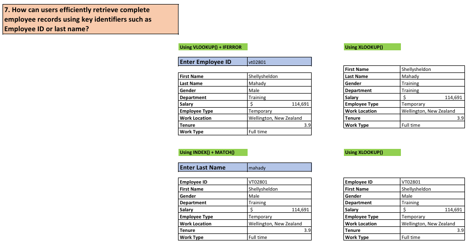
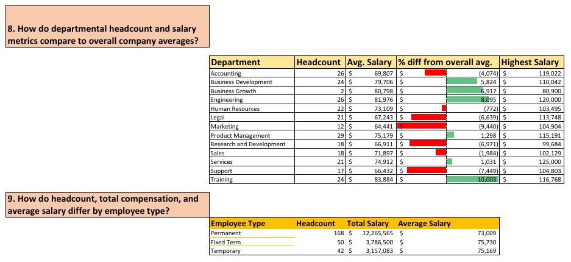

## 🎯 Objective

The goal of this project is to explore and apply key Excel functions to analyze employee data and answer common business-related questions.  
This project emphasizes **problem-solving using formulas** rather than dashboarding or visualization.

---

## 🧰 Tools & Functions Used

**Platform:** Microsoft Excel  

**Functions Applied:**  
- `FILTER()` – extract specific records based on conditions  
- `VLOOKUP()` – vertical lookup of values  
- `XLOOKUP()` – flexible lookup for values  
- `SUMIFS()` – conditional summing  
- `COUNTIFS()` – conditional counting  
- `AVERAGEIFS()` – conditional averaging  
- `DATE()` – create or manipulate dates  
- `YEAR()` – extract year from a date  
- `TEXT()` – format numbers or dates as text  
- `INDEX()` – return value from a table/range by row/column  
- `MATCH()` – find position of a value in a range  
- `LARGE()` – return nth largest value  
- `IFERROR()` – handle errors in formulas  
- `SORT()` – sort ranges dynamically  
- `UNIQUE()` – return distinct values from a range

---

## 📊 Business Questions Solved

1. **Which employees earn above a specified salary threshold, and what are their key details (Employee ID, name, department, and salary)?**    
   

2. **Among employees earning above a defined salary threshold, how does the distribution differ between male and female employees?**    
   

3. **Which employees joined the company within a specific year?**   
   

4. **How many employees joined the company each year?**   
   

5. **Which employees joined the company in a specific month and year?**    
   

6. **What are the minimum, maximum, and top five salary values segmented by gender?**  
   

7. **How can users efficiently retrieve complete employee records using key identifiers such as Employee ID or last name?**  
   

8. **How do departmental headcount and salary metrics compare to overall company averages?**  
9. **How do headcount, total compensation, and average salary differ by employee type?**  
   

---
   ## 🔍 Key Highlights

- Applied Excel functions to solve multiple business scenarios  
- Performed salary and workforce analysis across different dimensions  
- Built dynamic queries using filtering and lookup techniques  
- Implemented conditional aggregations for meaningful insights  
---

## 🚀 What I Learned

- How to translate business questions into Excel-based solutions  
- Practical use of advanced Excel functions in real scenarios  
- Data filtering, aggregation, and lookup techniques  
- Structuring analysis for clarity and usability  

---

## 📌 Note

This project is part of my learning journey in data analysis.  
It focuses on **Excel function proficiency and analytical thinking**, and serves as a foundation for more advanced projects involving dashboards and visualization.
